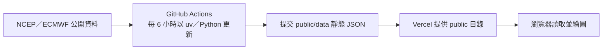

# 西北太平洋氣旋集合預報追蹤器

這是一個不需要後端的西北太平洋氣旋集合預報頁面。資料由 GitHub Actions 定期下載並整理成靜態 JSON，Vercel 只負責提供 `public/` 內的檔案；瀏覽器再於同一來源讀取資料並繪製路徑、最大風速與中心氣壓。

v1 支援五個資料來源：NCEP GEFS、NCEP AIGEFS、NCEP AIGFS、ECMWF IFS ENS 與 ECMWF AIFS ENS。範圍限於西北太平洋編號 `01W`–`49W` 及擾動編號 `90W`–`99W`。Google 實驗性氣旋資料不包含在 v1。

## 架構與資料流程



執行期間沒有應用程式伺服器、資料庫、外部圖磚、CDN 或遠端字型。地圖、JavaScript、CSS 與預報 JSON 都由相同網域提供。

## 本機需求

- Python 3.12
- [uv](https://docs.astral.sh/uv/getting-started/installation/)
- Git

專案使用 `uv.lock` 固定依賴版本。`uv sync` 的行為可參考 [uv 專案同步說明](https://docs.astral.sh/uv/concepts/projects/sync/)，GitHub Actions 使用官方 [astral-sh/setup-uv](https://github.com/astral-sh/setup-uv)。

## 在本機操作

先於專案根目錄安裝鎖定的正式與開發依賴：

```bash
uv sync --frozen --all-groups
```

更新所有資料來源，或只更新指定來源：

```bash
uv run cyclone-tracker update

uv run cyclone-tracker update --source gefs
uv run cyclone-tracker update --source aigefs
uv run cyclone-tracker update --source aigfs
uv run cyclone-tracker update --source ifs-ens
uv run cyclone-tracker update --source aifs-ens
```

更新會改寫 `public/data/`。它需要連線至資料提供者；單一來源失敗時，其他來源仍會繼續處理，且既有的有效資料不會被失敗結果取代。更新後可驗證資料與執行測試：

```bash
uv run cyclone-tracker validate public/data
uv run pytest
uv run ruff check .
uv run ruff format --check .
```

以本機 HTTP 伺服器預覽頁面：

```bash
uv run python -m http.server 8000 --directory public
```

接著開啟 <http://127.0.0.1:8000>。請勿直接以 `file://` 開啟 `public/index.html`；瀏覽器必須透過 HTTP 才能正確取得同一來源的 `data/manifest.json`、cycle JSON 與 ES modules。

## 資料格式與顯示規則

- `public/data/manifest.json` 記錄產生時間、各資料來源狀態與可選的起報時間。
- `public/data/<source>/<cycle>.json` 保存該來源、該起報時間的集合成員與平均路徑。
- 每個來源最多保留最近 12 個成功 cycle；「沒有符合條件氣旋」也是有效的成功 cycle，並會納入保留數量。
- 下載或解析失敗會留下先前有效 cycle，並在 manifest 記錄 `stale` 或 `error` 狀態。頁面會顯示空資料、過期或錯誤提示，使用者仍可切換到其他可用來源。
- JSON 的標準最大風速欄位維持 knots（`wind_kt`），並保留來源數值與來源單位。頁面可切換 knots 與 m/s，選擇會保存在瀏覽器；換算採 `1 kt = 0.514444 m/s`，顯示到小數一位，因此 `100 kt = 51.4 m/s`。

空 cycle 並不表示流程故障，只代表該次起報在支援的西北太平洋編號範圍內沒有氣旋。先查看頁面上的「資料狀態」與 manifest，再判斷是否需要排錯。

## 建立 GitHub 儲存庫與啟用 Actions

此部署流程以公開 GitHub repository 為前提。Vercel 對私人儲存庫的自動部署會檢查 commit 作者是否有專案存取權，而資料更新 commit 的作者是 `github-actions[bot]`；使用私人儲存庫可能因此無法觸發部署。GitHub 官方的建立方式請參考[建立新儲存庫](https://docs.github.com/en/repositories/creating-and-managing-repositories/creating-a-new-repository)。

若這份 checkout 尚未設定 Git remote，確認已登入 GitHub CLI 且遠端同名儲存庫不存在後，可於專案根目錄執行一次：

```bash
gh auth status
gh repo create Chih-Yao/cyclone_tracker --public --source=. --remote=origin
git push -u origin main
```

如果遠端儲存庫已存在，請先確認擁有者與公開狀態，再用 `git remote add origin <URL>` 設定遠端；不要再次執行建立命令，也不要 force-push。

推送後依序設定：

1. 在 GitHub 儲存庫開啟 `Settings → Actions → General`。
2. 找到 `Workflow permissions`，選擇 `Read and write permissions` 並儲存，讓 workflow 能提交更新後的 `public/data`。
3. 開啟 `Actions` 分頁，選擇「更新氣旋預報資料」，按 `Run workflow` 手動測試。
4. 確認「安裝鎖定依賴」、「更新所有資料來源」、「驗證靜態資料」與「提交並推送有效資料」各步驟的執行紀錄。

workflow 的 cron 是 `17 */6 * * *`，也就是 UTC 每 6 小時的第 17 分執行一次。排程 workflow 會使用 default branch 的最新 commit；手動 `workflow_dispatch` 也必須先存在於 default branch 才會顯示。GitHub 排程可能因平台負載延後，並非精準計時器。設定細節可參考 [workflow 語法](https://docs.github.com/actions/using-workflows/workflow-syntax-for-github-actions)及[儲存庫 Actions 設定](https://docs.github.com/en/repositories/managing-your-repositorys-settings-and-features/enabling-features-for-your-repository/managing-github-actions-settings-for-a-repository)。

## 部署至 Vercel

1. 在 Vercel 選擇 `Add New… → Project`，再以 `Import Git Repository` 匯入 `Chih-Yao/cyclone_tracker`。
2. 將 `Framework Preset` 設為 `Other`。
3. `Root Directory` 使用 `.`。
4. 將 `Build Command` 與 `Install Command` 停用或留空。
5. 將 `Output Directory` 設為 `public`。
6. 將 `Production Branch` 設為 `main`，完成第一次部署後檢查首頁、`/data/manifest.json` 與瀏覽器開發者工具。

儲存庫內的 `vercel.json` 已預先設定相同的無框架靜態輸出、快取與安全標頭。推送到 `main` 會觸發正式部署；GitHub Actions 後續提交有效 JSON 時，也會產生新的部署。若要手動重新部署，先確認目標 commit 已包含最新的 `public/data`。Vercel 設定可參考[建置設定](https://vercel.com/docs/builds/configure-a-build)與 [Git 整合](https://vercel.com/docs/git)。

## 逐步排除問題

1. **本機頁面空白或控制項一直載入**：確認網址是 <http://127.0.0.1:8000>，不是 `file://`；回到專案根目錄重新執行本機 HTTP 指令，並查看瀏覽器 console 是否有 404。
2. **Actions 無法 commit 或 push**：確認 `Settings → Actions → General → Workflow permissions` 已選 `Read and write permissions`。在失敗的執行工作中查看 `git commit`、`git pull --rebase` 與 `git push` 的紀錄。
3. **manifest 為空、來源顯示 stale／error，或沒有氣旋**：先執行 `uv run cyclone-tracker validate public/data`。空 cycle 是有效狀態；來源故障時可切換到其他來源，舊的有效資料應仍保留。若所有來源都失敗，再檢查本機網路與各官方端點。
4. **NCEP 更新遇到最新 cycle 的 403**：程式會往前嘗試最多 8 個候選 cycle；只有候選都無法取得完整檔案時才回報來源失敗。若持續失敗，查看 Actions 紀錄中的來源訊息，稍後重試，並保留既有有效資料。
5. **ECMWF 下載後無法解析 BUFR**：先重新執行 `uv sync --frozen --all-groups`，確認 `eccodes` 與 `eccodeslib` 都已安裝，再單獨執行 `uv run cyclone-tracker update --source ifs-ens` 或 `--source aifs-ens` 以縮小問題範圍。
6. **Vercel 顯示 404**：確認 `Framework Preset` 是 `Other`、`Root Directory` 是 `.`、`Output Directory` 是 `public`，且 Build／Install 指令為空。重新部署後直接檢查 `/data/manifest.json`。
7. **GitHub Actions 有新資料 commit，但 Vercel 沒有部署**：先確認 GitHub 儲存庫為公開。若使用私人儲存庫，`github-actions[bot]` 可能不符合 Vercel 的 commit 作者存取要求；改用公開儲存庫，或自行設計具適當身分的部署流程。

## 資料來源、授權與署名

- NCEP 資料來自 [NOAA NOMADS](https://nomads.ncep.noaa.gov/)。依 [National Weather Service 使用聲明](https://www.weather.gov/disclaimer)，美國政府提供的資料除另有標示外屬公有領域；使用時不得暗示 NOAA／NWS 為本專案背書。
- ECMWF 資料來自 [ECMWF Open Data](https://www.ecmwf.int/en/forecasts/datasets/open-data)，依[一般授權條款](https://apps.ecmwf.int/datasets/licences/general/)採 CC BY 4.0，使用時必須標示 ECMWF 並說明資料曾經處理。本專案建議保留頁面中的來源連結，並標示「Copyright © ECMWF 2026；資料已由本專案重新整理」。不得暗示 ECMWF 為衍生內容背書。
- 本機底圖使用 [Natural Earth](https://www.naturalearthdata.com/about/terms-of-use/) 公有領域資料；署名非必要，但本專案仍保留來源說明。

## 驗證狀態與使用限制

在 2026-07-15、開始撰寫本 README 前，本機完整驗證為 239 passed、1 個需明確開啟的網路測試 skipped；五個即時資料來源均完成結構驗證。正式檔案的瀏覽器 QA 結果為外部 runtime request 0、console error 0、水平 overflow `false`。GitHub Actions 雲端執行與 Vercel 實際部署目前尚未執行，因此第一次發布後仍須依前述步驟檢查執行紀錄與正式網址。

集合預報包含不確定性。本頁只供資料檢視與技術研究，**不取代中央氣象署或其他官方機構的警報**，也不可作為單一防災或撤離決策依據。
